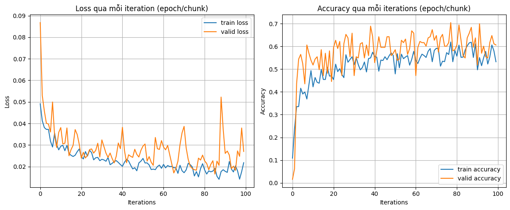
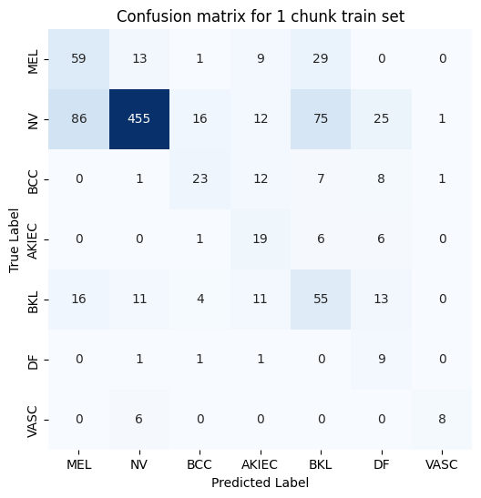

# HAM10k_with_MobileNet
## Skin lesions' images classification with MobileNet

HAM10KDataset [link](https://challenge.isic-archive.com/data/#2018) with [paper](https://arxiv.org/pdf/1803.10417).

Ham10K is an ISIC 2018 challenge's dataset with 7 classes of skin cancer diseases with about 10,000 iamges.
But the training dataset suffers a huge inter-classes data size imbalance and intra-class variant making it more difficult for models to learn the features of dataset.
Thus harder to make correct predictions. Even from the sources of the Ham10k dataset, doctor still struggle to confidently predict and verify 50% skin lesions without years follow-up cases, microscopic and colleges assitance. Making only the rest 50% of the dataset is pathologic verification.

~!!! Xong pipeline cơ bản rồi nhưng vẫn còn hơi lộn xộn quá

Một số hình ảnh trong quá trình pipeline

Biểu đồ loss và accuracy của mô hình trong quá trình training

Đồ thị confusion matrix của tập valid khi mô hình đạt val_acc cao nhất (~70.4%)

Đồ thị confusion matrix của mô hình với 1 chunk dữ liệu train (sau 10 epochs)

Giá trị loss và accuracy của mô hình khi huấn luyện dao động khá lớn có thể do learning rate vẫn còn khá cao.

Sau khi huấn luyện mô hình với 10 epochs, sẽ thực hiện suy luận với tập test và lưu kết quả vào 1 file "test_preds.csv"
Vì không có labels để đối chứng nên mình sẽ dùng độ phân bố của kết quả dự đoán và độ tin cậy để đánh giá kết quả

